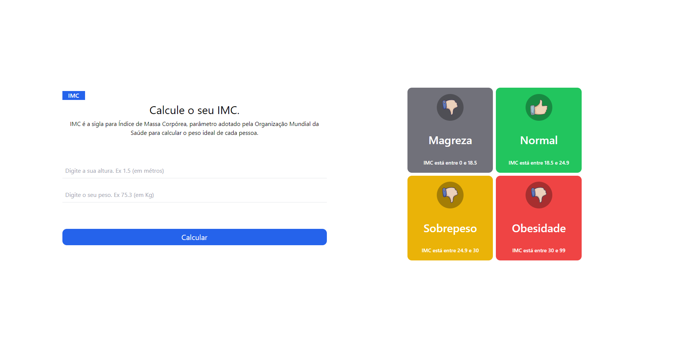

# Calculadora de IMC

Projeto em React + Typescript
fazendo uma calculadora de IMC

Projeto desenvolvido por mim: [Steve](https://imcdev.vercel.app/)

### Instalação

- `npm install` / `npm i`

### Para rodar

- `npm rum dev` / `npm start`

##

